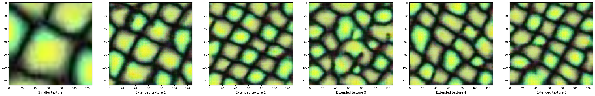
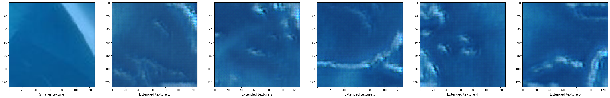

# Texture Synthesis with Self-Attention GANs

This is the repository of a texture synthesis GAN model, enhanced with a self-attention mechanism. In "datasets/half", you can find the original images I used for training. 
These are some results achieved:

## Good results

## Bad results
Bad results were due to the lack of fine-grained details when cropping the 64x64 square from the 256x256 input image.

